# Firestore Security Rules

The rules are there as a safety net to protect data from hackers or abuse. Your first protection is the child side validation of data you’re sending to the firestore, cloud storage or the realtime database.
As the firebase API keys are exposed at the client side they can be abused by a hacker or malicious user to send abusive data to firebase resources or hack valuable customer information for spam and other uses. To protect such acts, firebase security rules, that allow CRUD and other methods to be executed only if they fulfil certain conditions and everything other than that will continue to be disallowed which is the default for every resource on firebase.
Thus we unlock for every method such as CRUD etc one by one. Once a method has been unlocked for access any disallowing rule after that won’t be read. Therefore make sure, that something you allow once, has to be allowed for 100% of all the use cases.

Try to use as less allow statements as possible. Only allow something that must be allowed 100% of the time. Because once something is allowed you cant disallow it again later in your code.

## Anatomy of the security Rule

The first line service cloud.firestore defines the service on which the rule will be applicable.
And the first match statement i.e. “match /databases/{database}/documents” puts us in the root of the firestore “/”.
From there onwards we use match blocks to put allow rules for methods selectively we want to allow at every firestore matching structure. Our match blocks should exactly match the firestore structure so that they apply in places where they are supposed to be applied. The condition of the allow statement must always resolve to a Boolean.

Allow method: if true (always allowed)
Allow method: if false (always disallowed)

## How to approach rules:

The best way to approach the rules, is to focus on building rules that only selectively allow methods of access that we need 100% of the time and remember everything else will be blocked by default anyways. To disallow something we would have to put a condition in place that returns false for one or many possible access scenarios for given methods in the allow statements.

## Security rules are applicable to:

Security rules only apply to client side access and not for the background functions run on firebase servers. The firebase functions have unrestricted access to all the resources of the firebase and security rules defined for a particular service such as firetore, storage or RTDB wont apply to them.
Match all documents in the collection at this level
Match /{docId}

## Nesting match blocks

In order to apply rules to subcollections or paths we can nest the match blocks in a way that they match the db model structure and selectively allow a certain path/ subcollection or document for a method.
Include all subcollections in this rule
In order to match all collections, sub-collections and their documents we use this statement. {document=\*\*} is a recursive wildcard that will include all the subcollections as well in this match.

## Allow a single document

Match /users/ “docId”
This match block will only allow the document with the given docId as string value in the users collections at the root of the firestore or if its nested inside another match block. Then it will apply at the matching /users collection inside the outer match blocks

## One: Disalow everything in all collections

The following rule: will disallow everything on firestore from read & write, which we don’t have to explicitly mention though as it is the default behavior. But can be a good practice to put it at top for a reminder though
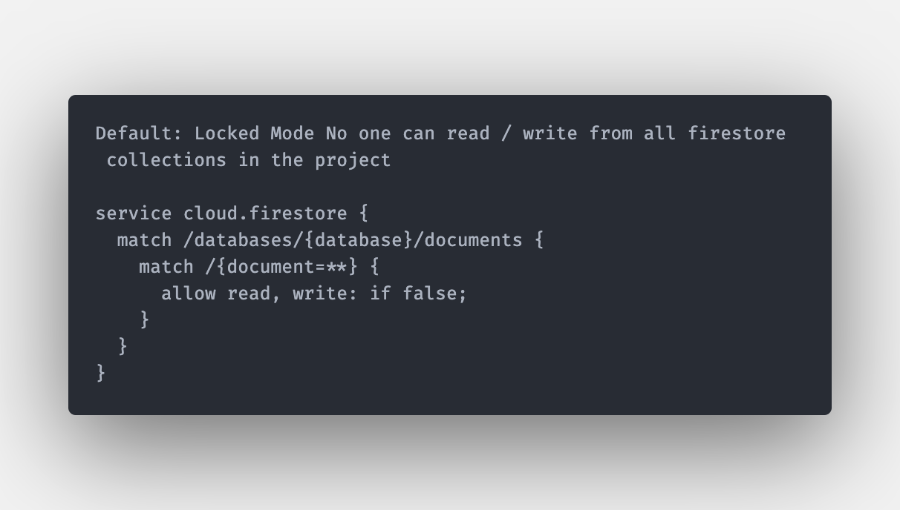

## Two: Allow read & write to all collections / path by authenticated users only

The following rule, will check the request global object and the auth object on it, if its not null i.e. the user has been authenticated and currently logged in on the client side, only then he can read or write to all the collections / paths in the firestore.
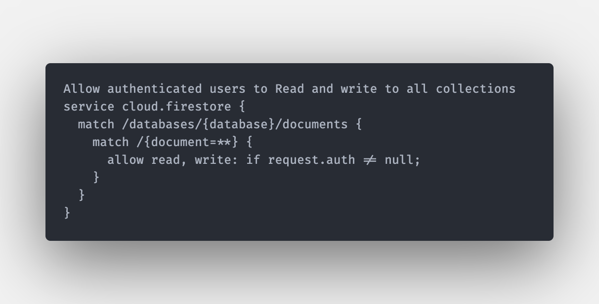

## Third: use docId in the rule

In order to use the docId inside the security rule we pass it in wildcard i.e. {docId} and then docId can be used as a variable inside the security rule such as:
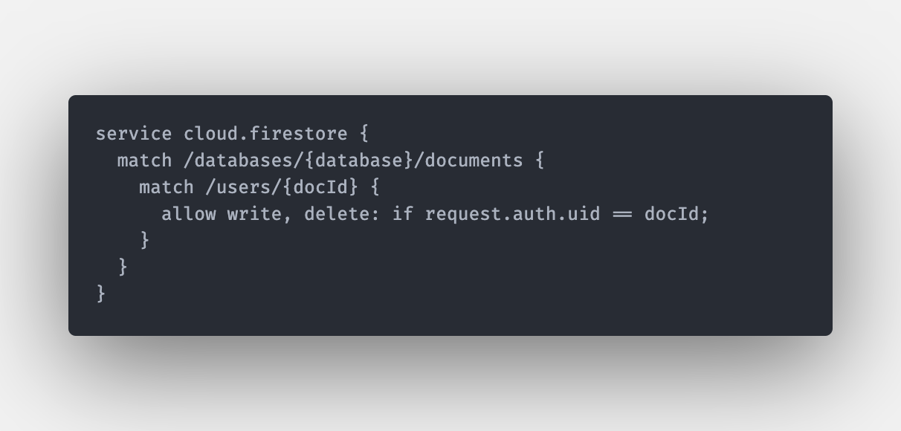

## Allow access to the owner of a document only

Allow delete and write by the owner user only. i.e. we created documents for every user in the users collections which is a root collection using a background auth function that runs onCreate of a new user signing up with firebase authentication providers/ methods. And the UID for that user is then used as the docId for the document inside the users collection for a 1-1 relationship. And the previous rule does exactly that as well.

Subcollections of a document default behavior
The subcollections of a document are not accessible if the parent document is allowed to be accessible for a method in a match block by default. In order to allow that we would have to explicitly mention that either in the parent match block using a recursive wildcard {docId=\*\*} or we would have to nest another match block inside the outer collection. Such as
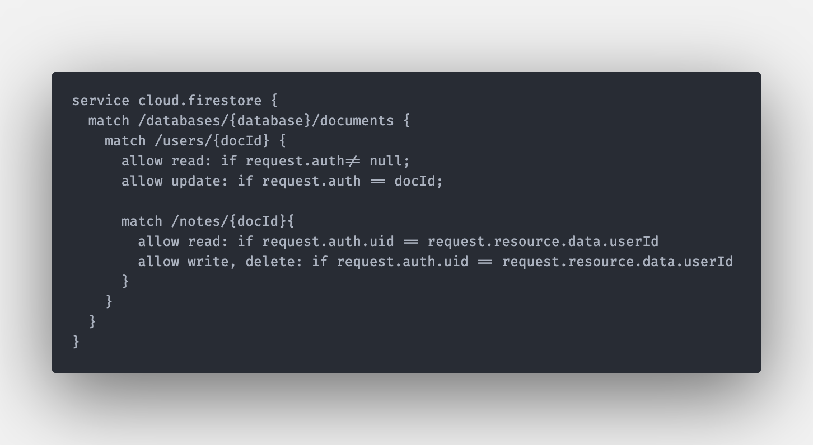

Operators allowed in the rules
&&, ||, ternary operators, ==, !=, a in b (to check exists in a list or map)
A is b ( for type check)
!a, -a, negation
A[i] , a(), a.f i.e. index, call, field access
And more

## Global objects available in the rules

### Request

The incoming context object available. It has following properties on it.
Auth ( request authentication context and has uid and token) and the token map has email, name, phone_number, and more fields on it.
Then the request has a string value for the method used. i.e. request.method
Path = path of the affected resource
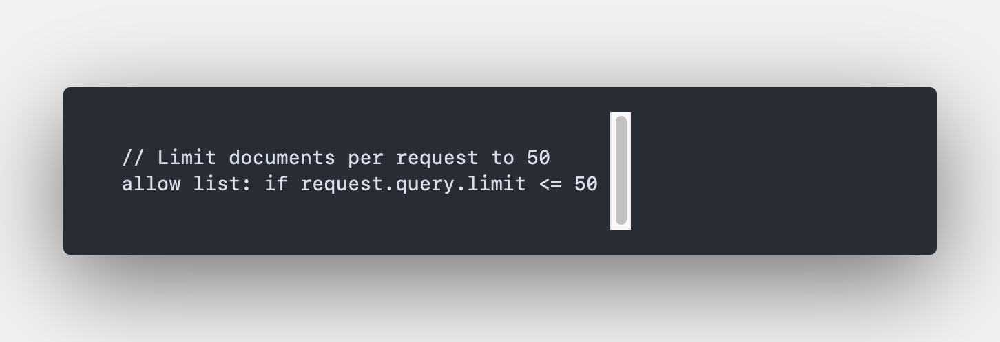
Query = map of query properties when present. i.e. limit, offset, orderBy

### Request.Resource

The new resource value, present on write requests only. Actual data payload that the user is trying to write to the db.
Time:
When the request was received by the service. For firestore write operations that include server-side timestamps, this time will be equal to the server timestamp.
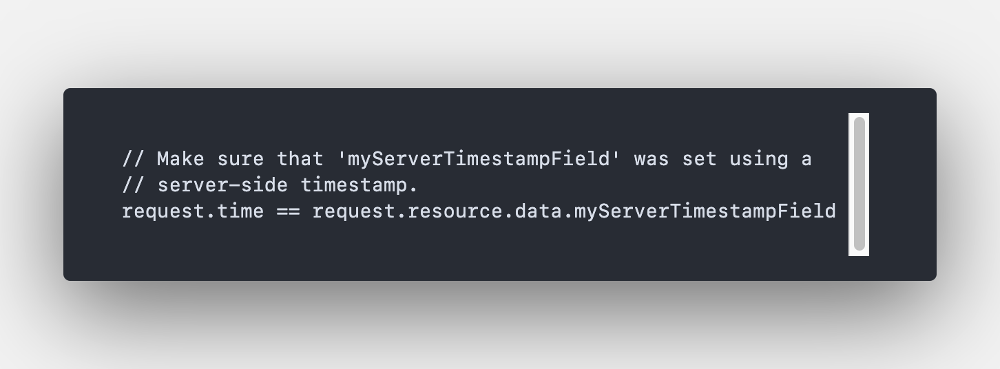

### Resource

The firestore document being read or written

### Data : map of the document data

// Check 'name' field from the document
resource.data.name == 'John Doe'

### Id: String of the document's key

resource['__name__'] ==
/databases/(default)/documents/collection/$(resource.id)

## for more global objects and API docs reference visit

https://firebase.google.com/docs/reference/rules/rules.firestore

## Example Immutable Usernames

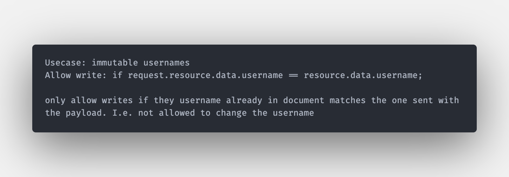

## How to have a user data in our db associated with every signed in user

When a user signs up using any of the providers of the firebase authentication ways provided, there isn’t any corresponding document created in the firestore db for him. However, we create an onCreate() auth background trigger function that creates a user document in a root users collection for every new user.
And in order to have a 1-1 relationship, we use the UID of the authenticated user as the document id for our user document. Thus every authenticated user can only have a one unique document in our users collection.
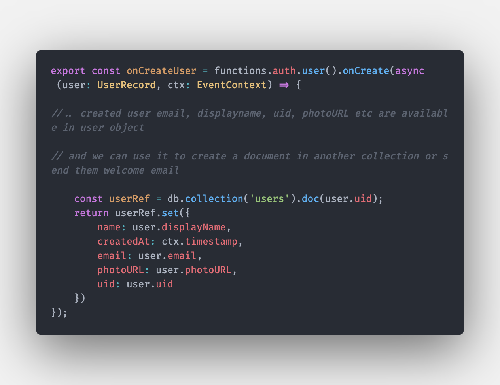

## OnlyAllow certain fields to be updated : has Only( )

If we want to allow only certain fields to be updated in a todos list, we use hasOnly() function and provide a list to it to check for, and if there are more than these fields in the request.resource.data then the condition will return false and the update method would fail to any document in the todos collection.
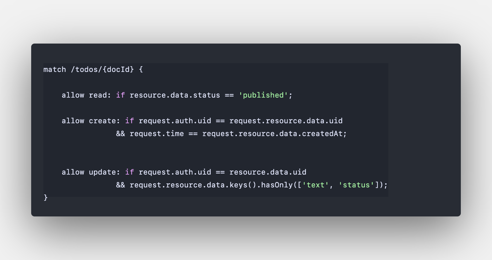

## Functions and variables in rules

We can make our rules easier and dry by using functions and local variables inside them, and call them with arguments.

Where we define our functions matters, as they are scoped to the block they are defined in. It’s a best practice to define all your functions at the end of the root block. So that they have access to the global request and resource objects as well. And we can then pass them arguments when we call them from a certain block too.

## Always Check for timestamp for creating or updating records

Any data i.e. sorted in the clients feed, must have two protections one it must always use the serverTimeStamp for when creating a document for the createdAt field. And secondly the update, create methods must check for the following rule. To prevent any false timestamp created just to rank post higher than the rest of the documents.
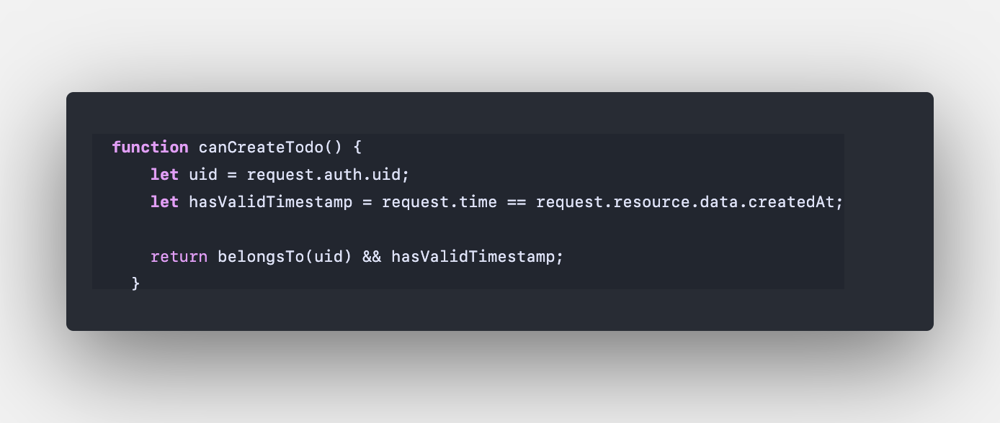

## Example of Functions and variables

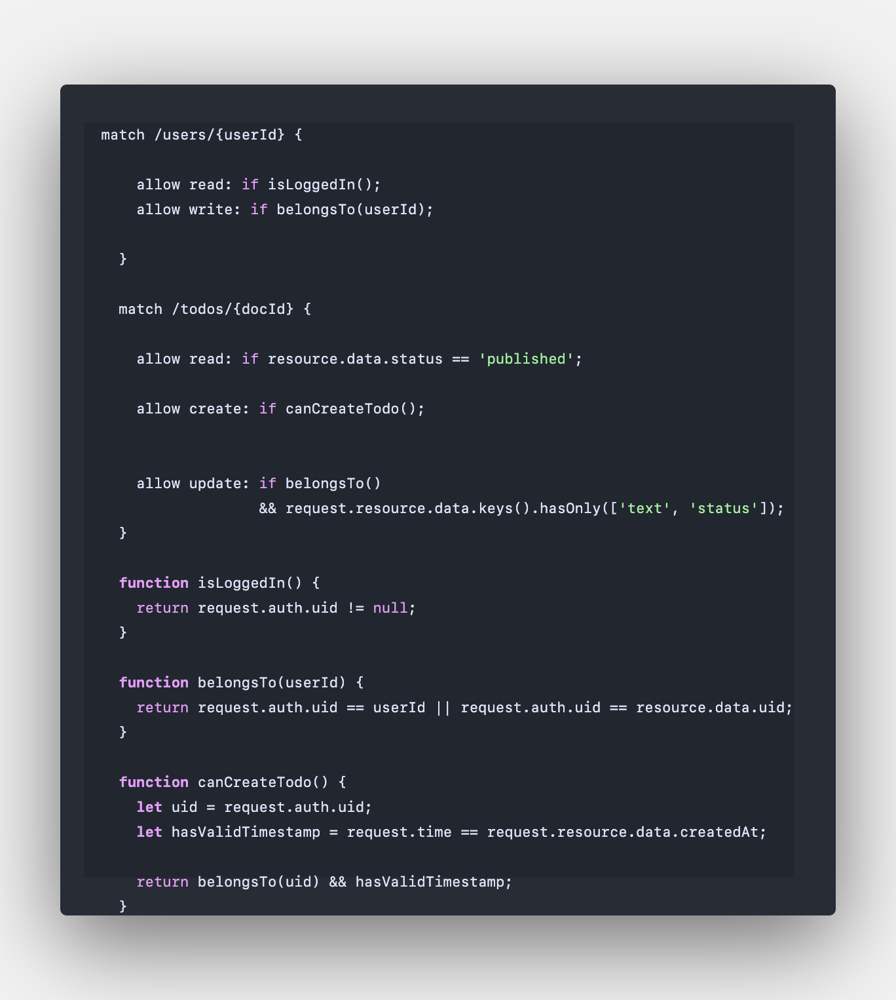

How to Read documents other than resource document in a rule
There are cases, where in order to allow an access method in a collection / document we have to check for certain fields or documents in another collection. This is very important where we have secure collections, containing documents that can not be accessed client side with valuable information. And are only used on server side. This is an important part of data modelling in firebase, where we keep sensitive information in separate collections and don’t allow them client side access.
As security rules: have a caveat that once a document is accessible i.e. CRUD, its accessible for that method in its entirety we can not restrict certain fields for an allow rule.
Secondly: the rules apply to the entire collection therefore, to restrict certain access methods for sensitive data, we keep them in separate collections with their own rules. And just use them server side.

To do that we have get and exists methods. Get method returns the actual data, and the exists just returns Boolean if the document exists at a certain path or not.
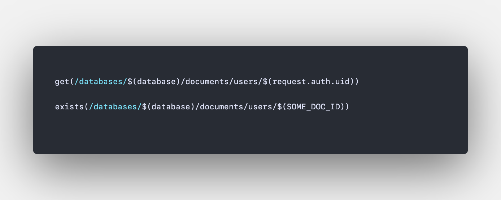

## Example of reading another document from another collection

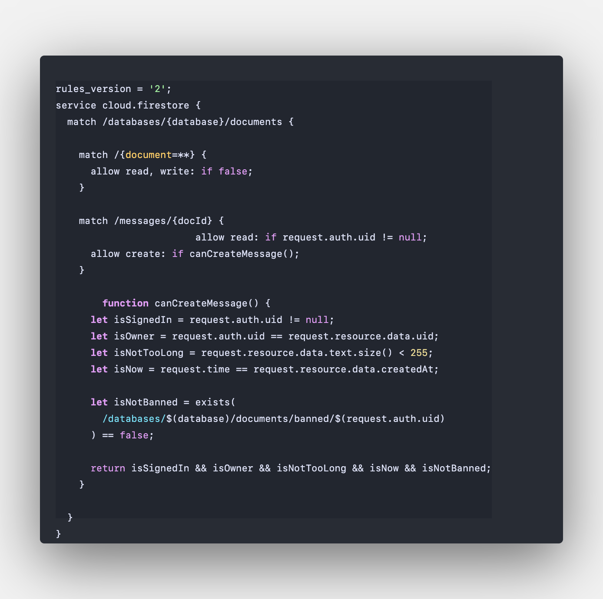

In the above example, we have a root banned collection that contains empty documents with the userId as its its document ID. Therefore in order to allow access we just have to check if a certain document exists in a collection with that users UID then we would prevent that method execution.

Get and exists, results in a document read billing count therefore, we must short circuit our conditions in a way that the most common check should be performed first, so that reads are only done for as few cases as possible such as
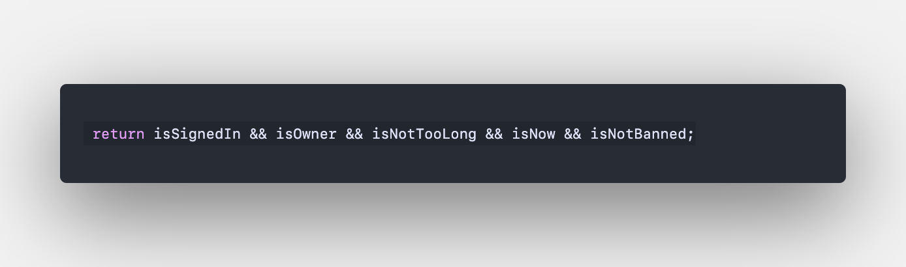

First, we check auth state, and then owner, and then character count and in end we make a exists read. Thus reducing our bill for reads for as few instances as possible

## Role based Auth Rules

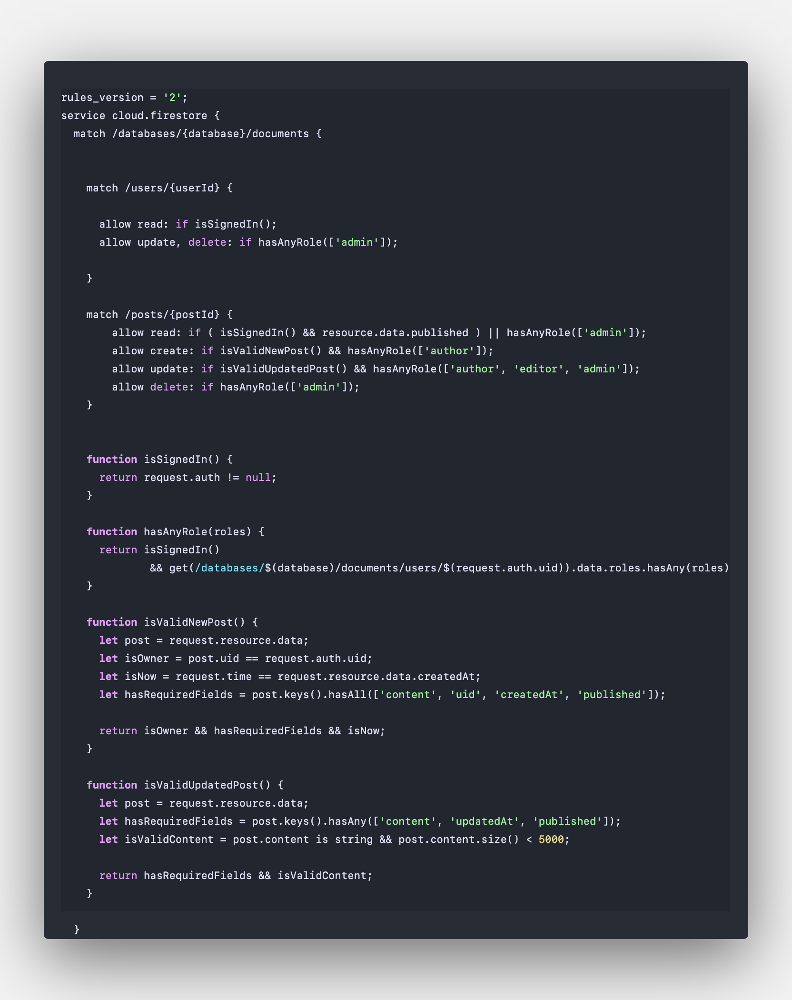

In this example, we create a user document for every signing up user, in our users collection and then assign them a roles array / map. And only allow updates to the user document by a user who has an admin role in that array to any of the user documents in the entire users collection.
Thus only an admin can change the documents of other users. But any loggedin user can read any users document in this case.

## Unit Testing

Its always better to test your firestore rules before you deploy them.

Create the files test/rules.test.js and test/helpers.js.
Install Jest and the Firebase Testing Package.
$npm install --save-dev jest @firebase/rules-unit-testing firebase-admin

Add the following script.
package.json
"scripts": {
"test": "jest --env=node --forceExit",
},

After adding rules and helpers
Run the following command
$firebase emulators:start

## Coverage Report

Localhost:8080/emulator/v1/projects/<project_id>:ruleCoverage.html

This report will help us uncover security rules issues that we might not expect exist.
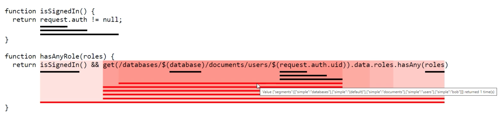
